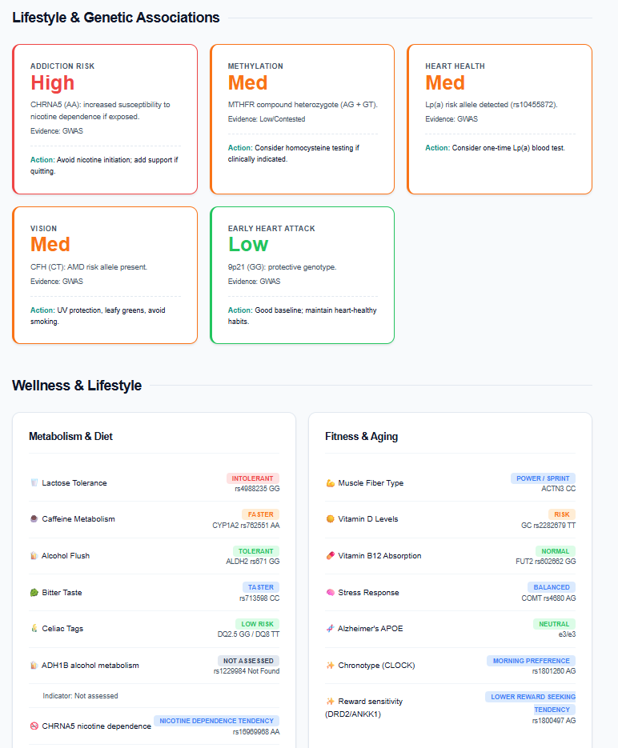

# DNA-Health-Analysis

A reproducible, AI-assisted pipeline to analyze raw DNA text files (AncestryDNA, 23andMe, MyHeritage) for health, lifestyle, and pharmacogenomic insights.

This was built using AI coding agents with science skills from [K-Dense-AI](https://github.com/K-Dense-AI/claude-scientific-skills).

It leverages a download from [GWAS Catalog - The NHGRI-EBI Catalog of human genome-wide association studies](https://www.ebi.ac.uk/gwas/docs/file-downloads) for locally storing the "All associations v1.0.2 - with added ontology annotations, GWAS Catalog study accession numbers and genotyping technology".

## Quick Start

### 1. Prerequisites
You need **[Astral's uv](https://docs.astral.sh/uv/)** installed on your machine. This tool handles Python dependencies and script execution automatically.

### 2. Setup
Clone this repository and navigate into it:
```bash
git clone https://github.com/j-loquat/DNA-Health-Analysis.git
cd DNA-Health-Analysis
```

### 3. How to Run (AI-Assisted)
This project is designed to be driven by an AI coding assistant.
1.  Open this folder in your preferred AI-enabled environment:
    *   **CLI Tools:** Gemini CLI, Codex CLI, Claude Code.
    *   **IDE Extensions:** VS Code with GitHub Copilot, Cursor, etc.
2.  Open the file **`USE_THIS_PROMPT.txt`**.
3.  Copy the entire text from that file.
4.  Paste it into your AI chat window and run it.

The AI will handle the execution of the pipeline, which includes verifying file integrity, querying SNPs, analyzing health risks, and generating a final report.

---

## Pipeline Overview

This workflow follows the steps detailed in [`DNA_Analysis_Steps.md`](DNA_Analysis_Steps.md):

1.  **Ingestion & QC:** Normalizes raw data to Parquet and checks data quality.
2.  **Core Wellness:** Checks "famous" SNPs (Lactose, Alcohol Flush, Caffeine, APOE).
3.  **Verification:** Validates strand orientation against Ensembl.
4.  **Aging & Life:** Analyzes longevity, vitamins, and methylation (MTHFR).
5.  **Hidden Risks:** Screen for high-stakes risks like Factor V Leiden, Lynch Syndrome, and Pharmacogenomics.
6.  **Expanded Panels:** Broader look at Cardiometabolic, Neuro, Cancer, and Functional Health traits.
7.  **Report Generation:** Synthesizes all findings into a comprehensive HTML/Markdown report.

## Disclaimer
**This is not medical advice.** This tool is for educational and research purposes only. Always consult a healthcare professional for medical diagnosis and decision-making.

## Sample Output
